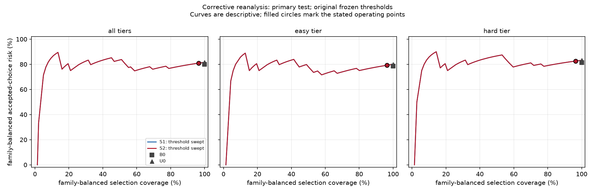
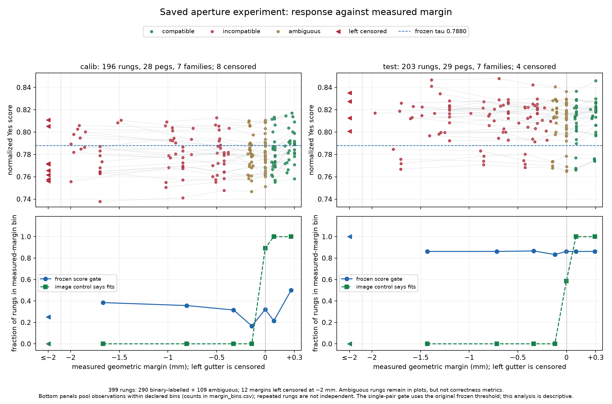

# When No Connector Fits

An independent, unofficial study of the visual matching stage of *Zero-Shot Peg Insertion: Identifying Mating Holes and Estimating SE(2) Poses with Vision-Language Models* (Yajima, Ota, Kanezaki and Kawakami, IROS 2025, [arXiv:2503.06026](https://arxiv.org/abs/2503.06026)). This is not the authors' code, and it does not reproduce their robot experiments or use their objects.

**Question.** When the compatible socket is missing from a set of candidates, can confidence-based rejection tell visually plausible but incompatible sockets apart while keeping useful correct selections?

**Short answer, on this benchmark: not reliably.** In my frozen primary configuration, the calibrated confidence gate accepted 56 of 58 mate-present and 56 of 58 mate-absent test sets, and selection accuracy was compatible with chance. With the paper's own prompt (an exploratory run), the model ranked visually distinct candidates well above chance, but look-alikes stayed hard and rejection helped mainly on easy sets. An image-only check on the same pixels recovered every unambiguous fit label.

## What I built

| Stage | What it does | Code |
|---|---|---|
| Parts | 72 procedural peg profiles in 18 shape families, each with a matching socket. Every socket is the same 40 × 40 mm block, so only the opening differs. | `scripts/make_parts.py`, `src/wncf/parts.py` |
| Fit oracle | Labels all 5,184 peg–socket pairs under a stated contract: rigid constant-profile parts, aligned centroids, quarter turns, straight insertion. Boundary cases and possible off-centre fits are marked ambiguous; loose fits are flagged. | `scripts/label_pairs.py`, `src/wncf/geometry.py` |
| Renders | One fixed orthographic camera at a known metric scale, top-down and 30° views, every image checked for scale and framing | `scripts/render_parts.py`, `src/wncf/render.py` |
| Candidate sets | 284 three-candidate blocks from 71 pegs: mate present or absent × easy or look-alike distractors. Look-alikes are chosen by geometry only, never by model score. | `scripts/build_sets.py`, `src/wncf/sets.py` |
| Scoring | LLaVA-OneVision-7B at a pinned revision; one yes/no question per peg–candidate pair; append-only hashed cache | `scripts/score.py`, `src/wncf/scorer_llava.py` |
| Decision rules | B0 (the paper's ranking), B1 (the paper's unique-Yes ablation), U0 (ungated top normalized score), S1 and S2 (calibrated score and score-plus-margin gates) | `src/wncf/rules.py` |
| Calibration and evaluation | Thresholds fitted on calibration families only, then frozen; family-bootstrap intervals | `scripts/calibrate.py`, `scripts/evaluate.py`, `scripts/reanalyze.py`, `src/wncf/metrics.py` |
| Diagnostics | Aperture ladders, image-only containment control, eight-shape reconstruction | `scripts/aperture_series.py`, `scripts/analyze_aperture.py`, `scripts/image_control.py`, `scripts/replica_3dprint.py` |

## Design

- I split the shape families before any scoring (seed 20260922): development (cross, dshape, ellipse, tube), calibration (ell, gear, notched, rect, square, tee, trapezoid) and test (chamfered, circle, double_d, keyed, obround, polygon, star).
- I froze the primary configuration before any candidate block existed: `llava-hf/llava-onevision-qwen2-7b-ov-hf` at revision `0d50680527681998e456c7b78950205bedd8a068`, 4-bit NF4 decoder, per-image high-resolution tiling (about 0.068 mm per model pixel), the `qwen_1_5` chat wrapper, neutral grey renders, and a `controlled` prompt that spells out the geometric rules. With this prompt, B0 is the paper's ranking rule applied to my inputs, not a re-run of the authors' method. K = 3, so chance top-1 is 1/3.
- S1 and S2 thresholds were fitted on calibration families only and frozen (`results/freeze/freeze_record.json`) before the single test pass (`results/test/test_pass_record.json`, which records the freeze hash).
- Three sensitivity arms were declared in advance and run on calibration blocks only: paper-style appearance, the paper's prompt, and int8 precision. The appearance arm had a declared trigger (no ungated selector had a 95% family-bootstrap lower bound above chance on easy calibration sets), which fired.
- The paper-prompt test run and a development sanity check under the paper's prompt were chosen after the primary test result was known, so they are exploratory.
- "Predeclared" and "frozen" refer to the records in this repository; there is no external preregistration.

## Results

### Primary test (116 blocks, 7 families)

My plan called for equal weight per shape family, but the evaluator that ran the test pooled all blocks. The table applies the planned weighting to the saved scores with the original frozen thresholds (`results/corrected/primary/`); the original pooled output is unchanged in `results/test/`. Brackets are 95% family-bootstrap intervals, which are wide with seven families.

| Method | Correct-selection yield (mate present) | Accepted-choice risk | Mate-present acceptance | Mate-absent acceptance |
|---|---:|---:|---:|---:|
| B0, paper's ranking | 0.400 [0.143, 0.671] | 0.800 | 1.000 | 1.000 |
| B1, unique Yes | 0.000: never selects, every candidate gets "Yes" | undefined | 0.000 | 0.000 |
| U0, top normalized score | 0.368 [0.100, 0.693] | 0.816 | 1.000 | 1.000 |
| S1 = S2, frozen `tau` 0.788 | 0.368 [0.100, 0.693] | 0.809 | 0.964 | 0.964 |

In the original pooled counts, B0 selected the mate in 24 of 58 mate-present sets, and S1 accepted 56 of 58 mate-present and 56 of 58 mate-absent sets, with 92 of its 112 selections wrong. To see the effect of rejection alone, compare S1 with U0 rather than B0, because B0 ranks candidates differently. The frozen threshold rejected almost nothing because the top score's median shifted from 0.790 on calibration families to 0.823 on test families.



### Sensitivity arms (calibration blocks, pooled counts)

| Arm | What changes | B0 / U0 top-1 | Acceptance at the arm's own calibration |
|---|---|---:|---|
| Primary | — | 0.36 / 0.46 | S1: mate-present 0.71, mate-absent 0.71 |
| Appearance | red/green imitation of the paper's photos | 0.27 / 0.38 | S1: present 0.71, absent 0.79 |
| Prompt | the paper's own prompt | 0.66 / 0.79 (easy 0.86 / 0.89, hard 0.46 / 0.68) | S2: present 0.82, absent 0.66 |
| Precision | int8 instead of NF4 | 0.23 / 0.52 | S1: present 0.71, absent 0.62 |

The paper's prompt carries a strong ranking signal on these calibration blocks. Look-alikes cut it by 20–40 points, and confidence separates mate-absent from mate-present sets only weakly. The stricter `controlled` prompt suppressed the ranking signal, and the appearance arm did not restore it.

### Exploratory: the paper's prompt on the test split

Thresholds come from the prompt arm's calibration; nothing was fitted on test (`results/exploratory/prompt_test/`).

- B0 selected the mate in 21 of 29 easy sets and 13 of 29 look-alike sets (34 of 58 overall).
- On easy sets, raising the threshold lowered accepted-choice risk from 0.71 at full coverage to 0.4–0.5 at 20–40% coverage. On look-alike sets the reduction was small: from 45/58 (0.78) for U0 to 38/51 (0.75) for S1.
- The calibrated S1 threshold accepted 47 of 58 mate-absent sets and 51 of 58 mate-present sets, again because scores shifted between shape families.

### Diagnostics

- **Opening size.** For 57 calibration and test pegs, I shrank each peg's own opening in seven steps, from 0.20–0.30 mm of measured clearance to 1.2 mm or more of interference (12 margins are censored at the −2 mm search limit). The model answered "Yes" to all 399 pairs, the mean score per step moved by less than 0.01, and AUROC for fit versus no fit was 0.56 on calibration and 0.50 on test. Individual scores did move: the frozen gate changed its decision along the ladder for 12 of 28 calibration pegs and none of the 29 test pegs.
- **The information is in the pixels.** An image-only containment check that segments exactly the pixels the model receives agreed with the oracle on all 240 unambiguous development and calibration pairs, including every look-alike, and on all 290 unambiguous aperture pairs (109 ambiguous excluded). Near the boundary its margin error averaged 0.034 mm (worst 0.097 mm). This uses clean renders at a known scale; it says nothing about photographs.
- **Eight-shape reconstruction.** Approximations of the paper's eight 3D-printed shapes, scored with the paper's prompt and ranking, reached 6/8 top-1 at best over four configurations. It is a diagnostic, not a reproduction of the paper's 7/8.
- **Two confidence measures.** The paper ranks by the probability of the emitted answer token; S1 and S2 use a yes-probability normalized over answer spellings. They can pick different winners, which is why U0 is reported.



## Corrections after the test pass

I found and fixed these after the primary test result was known. The original records under `results/test/`, `results/freeze/`, `results/arms/` and `results/exploratory/` are unchanged. Corrected outputs are in `results/corrected/`, computed from the saved scores with no new model calls.

- **Family weighting.** The frozen evaluator weighted every block equally instead of every family, as planned. The corrected analysis uses the planned weighting with the original thresholds, and the conclusions do not change. Thresholds refitted under that weighting are reported separately as a post hoc sensitivity check.
- **B1 ranking.** B1 had been given U0's top-1 score. B1 is a decision rule with no ranking, so that field is now undefined.
- **Aperture axis.** The original aperture figure plotted the construction offset; the corrected analysis uses the oracle's measured margin, which differs for shapes with corners.
- **Safeguards.** Scoring and evaluation now check the full frozen configuration, the manifests and the input-image hashes, not only the blocks manifest, and the score cache recovers from a write interrupted mid-record.
- **Evaluator provenance.** `scripts/calibrate.py`, `scripts/evaluate.py` and `scripts/evaluate_exploratory.py` now write replays to `results/replays/` and can no longer overwrite the original run. The evaluator that produced `results/test/` is in the git history (SHA-256 `a14f02f84a443153…`).

## Limitations

- Synthetic, constant-profile parts and clean renders; no photographs or real connectors. The results describe this model on this benchmark, not the authors' method on their objects.
- One checkpoint, mainly in 4-bit precision. The paper does not state which LLaVA-OneVision size or preprocessing it used.
- The results depend strongly on the prompt.
- Seven test families give wide intervals, and blocks share candidates, so uncertainty comes only from resampling whole families.
- The reconstruction touched three test-family templates (circle, obround, polygon) and three calibration templates, and some contours are very similar across splits (for example `rect_03` in calibration and `double_d_02` in test, opening-contour IoU 0.95). The test split is therefore not a pristine holdout.
- Fixed K = 3, quarter turns only, centroids aligned, and loose fits excluded from candidate sets. Normalized answer scores are not calibrated probabilities of fit, and a deferral is not a verified statement that no socket fits.

## Repository layout

| Folder | Contents |
|---|---|
| `src/wncf/` | Library: parts, fit oracle, renderer, candidate sets, scorer, rules, metrics, provenance checks |
| `scripts/` | One script per pipeline stage, plus analysis and verification |
| `tests/` | Unit and regression tests |
| `data/` | Part catalogue, fit labels, splits, candidate blocks, aperture pairs, render manifests |
| `results/` | Freeze and test-pass records, original outputs, corrected analysis, score snapshot, figures |
| `cache/` | Local score cache (not committed; the snapshot is `results/scores/scores.jsonl`) |

## Reproducing

Requires Python 3.11 and [uv](https://docs.astral.sh/uv/).

```bash
uv sync --locked
uv run pytest
uv run python scripts/reanalyze.py
uv run python scripts/analyze_aperture.py
uv run python scripts/verify_project.py
```

These read the committed score snapshot and need no GPU or model weights. Seven tests that compare against the rendered images skip until `render_parts.py` has been run. `verify_project.py` checks the snapshot, the run records and every corrected output against its recorded hash, and recomputes the headline numbers.

To regenerate the geometry and renders, run `make_parts.py`, `label_pairs.py`, `render_parts.py` and `build_sets.py` in that order. Scoring with `score.py` needs an NVIDIA GPU with about 8 GB free for the 7B model in 4-bit and the pinned weights (cached in `~/.cache/huggingface`, or `WNCF_HF_HOME`). The test split can be scored only when the freeze record matches the current configuration, manifests and input images.
