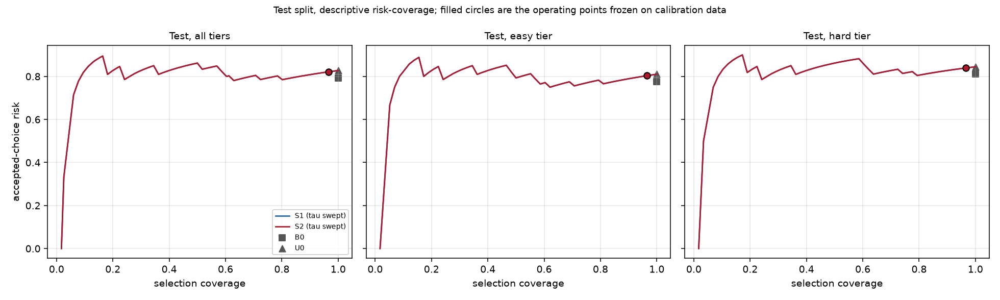
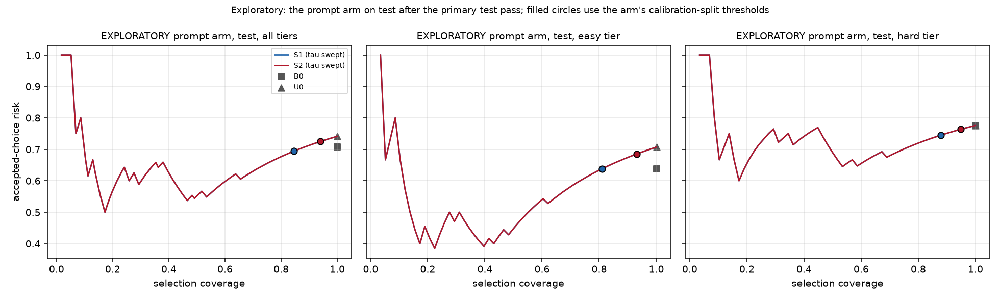

# When No Connector Fits

**Unofficial** study of the visual matching stage of *Zero-Shot Peg Insertion: Identifying Mating Holes and Estimating SE(2) Poses with Vision-Language Models* (Yajima, Ota, Kanezaki, Kawakami, IROS 2025, [arXiv:2503.06026](https://arxiv.org/abs/2503.06026)). The code is not the authors', has not been reviewed by them, and does not reproduce their robot experiments or evaluate on their objects.

**Question.** When a compatible mate is missing from a set of candidate sockets, can confidence-based rejection distinguish visually plausible but geometrically incompatible sockets while retaining useful correct selections?

**Short answer, pre-registered configuration, held-out test families: no.** Rejection accepted mate-absent sets as often as mate-present ones (0.97 each), and selection accuracy was compatible with chance.

The answer depends strongly on the prompt. A predeclared calibration-only arm and a later exploratory test run with the paper's own prompt show a real ranking signal on visually distinct candidates. Even then, rejection lowered risk only when the distractors were easy, never for look-alikes, and no run responded to an opening that was too small, although an image-only check shows the information is in the pixels. Details below.

## What is here

| Stage | What it does | Evidence |
|---|---|---|
| Parts | 72 procedural pegs and sockets in 18 shape families. Every socket is the same 40 × 40 mm block, so only the opening differs. | `scripts/make_parts.py`, `results/figures/stage1_profiles.png` |
| Fit oracle | Labels every peg–socket pair under a stated contract (centroids aligned, quarter turns, straight insertion), with an ambiguity band and a check that the label does not depend on a sideways nudge | `scripts/label_pairs.py`, 5,184 pairs, `results/figures/stage2_labels.png` |
| Renderer | One fixed orthographic camera, fixed metric scale, two views (straight down, 30°), every image checked for scale and framing | `scripts/render_parts.py`, `results/figures/stage3_contact_sheet.png` |
| Candidate blocks | Per peg, four blocks sharing one candidate: mate present or absent × easy or look-alike distractors. Look-alikes are chosen by geometry only, never by model score. | `scripts/build_sets.py`, 284 blocks from 71 pegs, `results/figures/stage5_*.png` |
| Scoring | LLaVA-OneVision-7B, pinned revision, NF4; one yes/no question per peg–candidate pair; append-only hashed cache | `scripts/score.py`, `cache/scores.jsonl` (snapshot in `results/scores/`) |
| Rules | B0 (the paper's ranking), B1 (the paper's unique-Yes ablation), S1 and S2 (calibrated confidence and margin gates), U0 (ungated normalized selector, diagnostic) | `src/wncf/rules.py` |
| Calibration and test | Thresholds fitted on calibration families only and frozen; a guard refuses test scoring until the freeze record matches the manifest | `scripts/calibrate.py`, `scripts/evaluate.py` |

Families are split before any scoring (seed 20260922): dev (4 families), calibration (7), test (7). All design decisions, the frozen configuration and every correction to earlier claims are in [`docs/protocol.md`](docs/protocol.md) and [`docs/decisions.md`](docs/decisions.md).

## Frozen configuration

`llava-hf/llava-onevision-qwen2-7b-ov-hf` at `0d50680527681998e456c7b78950205bedd8a068`; 4-bit NF4 decoder; per-image high-resolution tiling (`flat`, 0.068 mm per model pixel); the `qwen_1_5` chat wrapper; neutral grey renders; and a `controlled` prompt that states the geometric contract (shared scale, centred, quarter turns, straight insertion, shape and size only). With this prompt, B0 is *the paper's ranking rule applied to our inputs and prompt*, not a re-run of the authors' method. The configuration was frozen before any candidate block existed. K = 3 candidates; chance top-1 is 1/3.

## Results

### Primary, pre-registered: test split (116 blocks, 7 families)

| Method | Correct-selection yield (mate present) | Accepted-choice risk | Selects when no mate is present |
|---|---:|---:|---:|
| B0, paper's ranking | 0.41 [0.17, 0.65] | 0.79 | 1.00 |
| B1, unique Yes | 0.00: never selects, every candidate gets "Yes" | undefined | 0.00 |
| S1 = S2, frozen `tau` 0.788 | 0.34 [0.10, 0.67] | 0.82 | **0.97** (present coverage 0.97) |
| U0, top normalized score | 0.34 [0.10, 0.67] | 0.83 | 1.00 |

Brackets are 95% family-bootstrap intervals; with 7 families they are wide. Easy and hard tiers are reported separately in `results/test/test_metrics.csv`.



The risk–coverage curve is flat: no confidence threshold lowers the accepted-choice risk. The frozen threshold rejected almost nothing because every score sits in a narrow band that shifts between shape families. The top candidate's `p_yes` has median 0.790 on calibration and 0.823 on test, where round families score highest, so a threshold fitted on calibration families did not transfer.

Test results are also split by whether a query family's shape template was touched by the diagnostic reconstruction below (circle, obround, polygon) or not (chamfered, double_d, keyed, star): B0 top-1 0.65 against 0.22. The groups also differ in shape, so the gap cannot be attributed to exposure.

### Predeclared arms (calibration blocks only)

| Arm | What changes | B0 / U0 top-1 on calibration | Rejection at the arm's own calibration |
|---|---|---:|---|
| Primary | — | 0.36 / 0.46 | S1: present coverage 0.71, absent false acceptance 0.71 |
| Appearance (triggered by a declared chance-level rule) | red/green imitation of the paper's photos | 0.27 / 0.38 | S1: present 0.73, absent 0.79 |
| Prompt | the paper's own prompt | **0.66 / 0.79** (easy 0.86 / 0.89, hard 0.46 / 0.68) | S2: present 0.74, absent 0.66 |

On calibration blocks the paper's prompt carries a strong ranking signal, look-alikes cut it by 20–40 points, and even then confidence separates mate-absent from mate-present sets only weakly. The `controlled` prompt, adopted during review to state the geometric contract, suppressed the ranking signal. The appearance arm did not rescue it.

### Exploratory, after the primary test pass

These runs were chosen after the primary test result was known. They are hypotheses for future work, not confirmatory results.

**The paper's prompt on the test split.** Thresholds come from the prompt arm's calibration; nothing is fitted on test.

| Method | Top-1 or yield (mate present) | Accepted-choice risk | Present coverage | Absent false acceptance |
|---|---:|---:|---:|---:|
| B0, paper's ranking | 0.59 [0.35, 0.83]; easy 0.72, hard 0.45 | 0.71 | 1.00 | 1.00 |
| U0 | 0.52; easy 0.59, hard 0.45 | 0.74 | 1.00 | 1.00 |
| S1, `tau` 0.607 from calibration | 0.52 | 0.69 | 0.88 | 0.81 |
| B1 | never selects | undefined | 0.00 | 0.00 |



With the paper's prompt, ranking transfers to unseen test families above chance on easy sets and falls with look-alikes. The curve now slopes on easy sets: raising the threshold lowers accepted-choice risk from about 0.71 at full coverage to about 0.4 at 20–40% coverage. On look-alike sets it stays between 0.65 and 0.78 at every coverage. The threshold carried over from calibration again rejected little: 0.81 of mate-absent sets were accepted against 0.88 of mate-present ones, because the score distribution shifted between families.

**The dev sanity design under the paper's prompt** (identical 92 calls, only the prompt changed) is flat again. The mate scores 0.621, the look-alike 0.619 and the easy distractor 0.610; the mate beats its paired distractor in 16 of 28 comparisons; and the aperture ladder stays within 0.611–0.618 from a comfortable fit to 1.2 mm of interference.

**Across all runs** (a synthesis, not a confirmatory claim):
- The ranking signal depends strongly on the prompt, and where it exists it is weaker for look-alikes.
- It is absent on the round-heavy dev families under both prompts.
- No run responded to an opening that was too small.
- Confidence-based rejection helped only on easy sets, only under the paper's prompt, and a threshold fitted on one set of shape families did not carry over to another.

### Diagnostics

- **Information survives preprocessing.** An image-only containment check that segments the exact pixels the model receives (never the true polygons) recovers the oracle's fit decision on **240/240** dev and calibration pairs, including every look-alike, and tracks true margins to 0.002 mm on average near the boundary (`results/figures/image_control.png`). The model's failures are therefore not explained by lost image information.
- **Flat aperture response (frozen configuration, dev).** As the opening shrinks from a comfortable fit to 1.2 mm of interference (about 18 model pixels), `p_yes` moves by at most 0.02 per peg (`results/figures/sanity_aperture.png`).
- **Eight-shape diagnostic reconstruction.** Approximations of the paper's eight 3D-printed shapes, rendered in grey and in a red/green imitation and scored with the paper's prompt and ranking, reached 6/8 top-1 at best. That is the best of four configurations, n = 8, synthetic images and an unknown author checkpoint, so it is a diagnostic, **not** a reproduction of the paper's 7/8.
- **Two confidence measures, two selectors.** The paper ranks by the probability of the emitted answer token; S1 and S2 rank by a normalized yes-probability summed over spellings. They disagree on the winner often enough that U0 is reported, so a change of selector is never mistaken for an effect of rejection.

## Limitations

- **Synthetic, constant-profile geometry and synthetic images.** No real connectors or photographs are involved. The results bound this model on this task; they are not claims about the authors' objects or about robot insertion.
- **One checkpoint and precision.** The paper does not state which LLaVA-OneVision size it used. Everything here is the 7B checkpoint in 4-bit.
- **Prompt dependence.** The primary result used a prompt chosen before any calibration score existed; the paper's prompt behaved very differently on calibration data. The exploratory test run of the paper's prompt was chosen after the primary test result was known.
- **Few families.** Seven test families give wide intervals, and blocks share candidates, so only family-level resampling is used for uncertainty.
- **Family exposure.** The diagnostic reconstruction touched three test-family templates. The split was kept as recorded and results are reported for both groups; neither group is a pristine holdout.
- **Fixed K = 3 and a strict contract.** Quarter turns only, centroids aligned, loose fits excluded from candidate sets.

## Reproducing

Requires an NVIDIA GPU with at least 8 GB free for the 7B model in 4-bit, and [uv](https://docs.astral.sh/uv/). Model weights go to `~/.cache/huggingface` (or `WNCF_HF_HOME`).

```bash
uv sync
uv run pytest
uv run python scripts/make_parts.py
uv run python scripts/label_pairs.py
uv run python scripts/render_parts.py
uv run python scripts/build_sets.py
uv run python scripts/score.py --split dev calib
uv run python scripts/calibrate.py
uv run python scripts/score.py --split test --allow-test
uv run python scripts/evaluate.py
```

Everything up to scoring is deterministic and seeded. Scores are deterministic on a given machine and software stack; the cache key covers the checkpoint, precision, preprocessing, the full prompt, all four image hashes and library versions. A snapshot of every score used here is in `results/scores/scores.jsonl`. The arms, diagnostics and exploratory runs are listed with their commands in `docs/protocol.md`.
